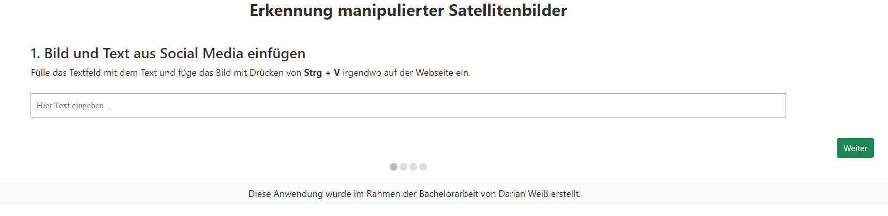
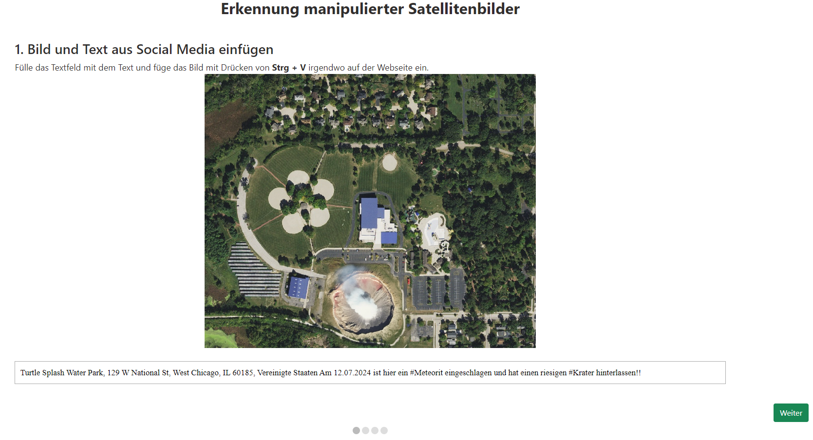
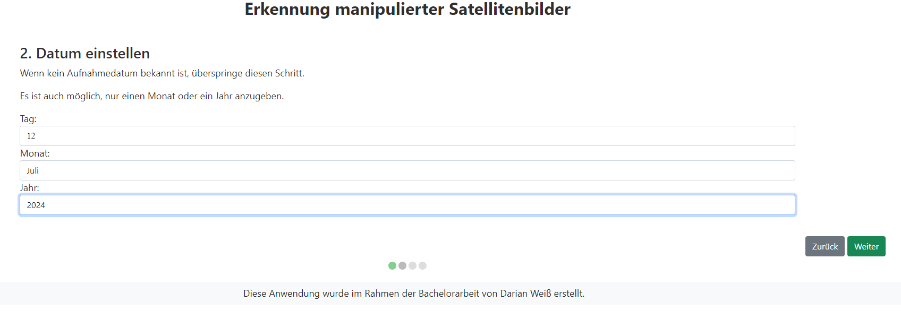
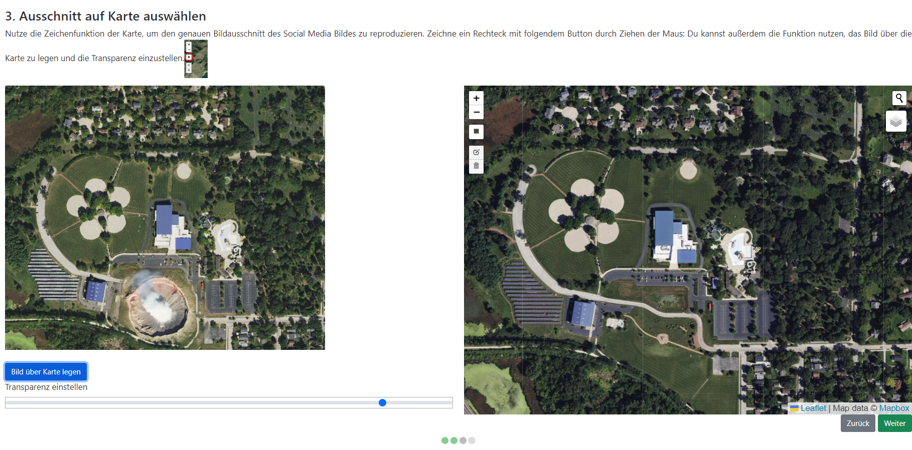
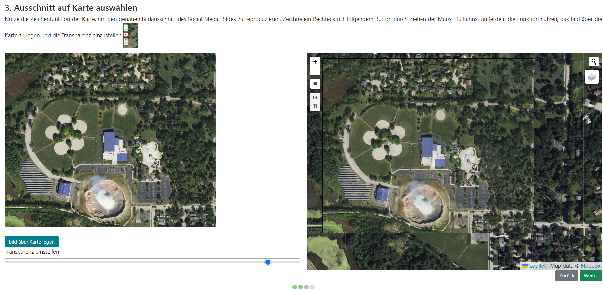
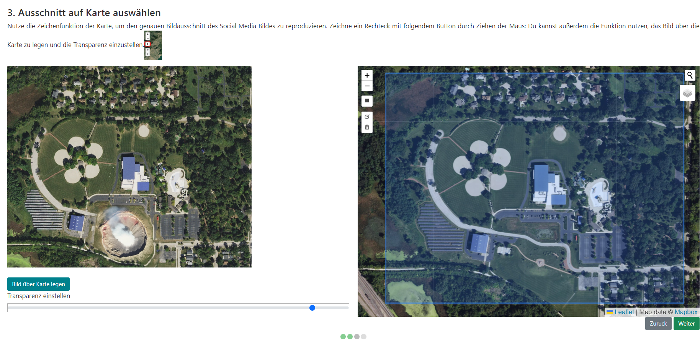

# Semi-automatische Erkennung manipulierter Satellitenbilder in sozialen Medien durch Vergleich mit Referenzdaten
English title: _Semi-automatic detection of manipulated satellite imagery in social media by comparison with reference data_

Dieses Repository enthält den Code der im Rahmen meiner Bachelorarbeit an der [Universität Münster](https://www.uni-muenster.de/Geoinformatics/) entwickelten Anwendung.

## Zusammenfassung
In den letzten Jahren haben sich die Möglichkeiten zur künstlichen Erstellung oder Manipulation von Bildern durch Fortschritte in Künstlicher Intelligenz (KI), Machine Learning und Computer Vision rasant weiterentwickelt. Vor diesem Hintergrund beschreibt diese Bachelorarbeit die Entwicklung einer Anwendung zur semi-automatischen Erkennung von gefälschten Satellitenbildern in sozialen Medien. Die Anwendung übernimmt die zeitaufwändigen Aufgaben des Text-Extrahierens, Lokalisierens und Vergleichens und ermöglicht es, die Ergebnisse einfach zu teilen. Durch die Kombination von Bildmanipulationstechniken, überwachtem maschinellen Lernen und Geocoding wird das Problem der Desinformation in sozialen Medien adressiert und ein Werkzeug zur Bekämpfung dieser geschaffen.

## Voraussetzungen
Es muss zusätzliche Software auf dem Gerät vorhanden sein und in der Datei server.py müssen einige Änderungen vorgenommen werden.  

**Google Earth Engine Account**  
Es muss ein Google Earth Engine Account erstellt und ein Authentifizierungs-JSON-Key generiert werden. Dieser ist im Verzeichnis zu hinterlegen. [Anleitung](https://developers.google.com/earth-engine/guides/app_key)  


**Anaconda und GDAL-Bibliothek**  
Für das Programm wird eine anaconda3-Installation benötigt. [Download](https://www.anaconda.com/download)  
Es wird ebenfalls eine Installation der GDAL-Bibliothek benötigt. [Download](https://gdal.org/download.html)  

Innerhalb der Anaconda-Umgebung muss dann das GDAL-Paket installiert werden:  
```conda install -c conda-forge gdal```  


**Anpassen der Pfade**  
In der Datei server.py müssen danach einige Änderungen vorgenommen werden:  
Anpassen des Pfades zum Earth Engine Key:  
31 ```key_file = [Hier Pfad einfügen]```  

Anpassen der Pfade zur Anaconda-Installation mit aktivierter GDAL-Bibliothek:  
432 ```python_exe = 'C:\\Users\\User\\anaconda3\\python.exe'```  
433 ```gdal_merge = 'C:\\Users\\User\\anaconda3\\Scripts\\gdal_merge.py'```  
591 ```python_exe = 'C:\\Users\\User\\anaconda3\\python.exe'```  
592 ```gdal_merge = 'C:\\Users\\User\\anaconda3\\Scripts\\gdal_merge.py'```  

Anpassen der Pfade zum GDAL-File gdal_translate.exe  
463 ```gdal_translate = 'C:\\Program Files\\GDAL\\gdal_translate.exe'```  
618 ```gdal_translate = 'C:\\Program Files\\GDAL\\gdal_translate.exe'```  
            

## Anleitung zum Starten der Anwendung
Um alle notwendigen npm-Packages zu installieren, muss in der Programmierumgebung ein neues Konsolenfenster geöffnet und folgender Code eingegeben werden:  
```npm install```

Nach erfolgreicher Installation muss ein zweites Konsolenfenster geöffnet werden, um das Frontend und das Backend separat zu starten  
In Konsolenfenster 1 muss dann folgender Code eingegeben werden:  
```npm start```

In Konsolenfenster 2 muss dann folgender Code eingegeben werden:  
```python run_server.py```

## Anleitung zur Nutzung der Anwendung
Nach erfolgreichem Start des Frontends und Backends in der Programmierumgebung ist das Webinterface im Browser unter der Domain **http://localhost:3000/** erreichbar.

### Schritt 1
Hier wird das Bild und der Text des Social Media Posts eingefügt.
<br>

<br>
<br>
So sieht die Seite nach dem Einfügen aus:
<br>

<br>
<br>
### Schritt 2
Hier wird das Aufnahmedatum eingegeben
<br>

<br>
<br>
### Schritt 3
Hier wird der Kartenausschnitt gewählt, um das Social Media Bild zu reproduzieren
<br>

<br>
<br>
Es ist möglich, das Bild als transparentes Overlay über die Karte zu legen
<br>

<br>
<br>
Mithilfe des Leaflet Draw-Plugins wird ein Bereich gezeichnet
<br>

<br>
<br>
### Schritt 4
Auf der Ergebnisseite werden die Ergebnisse angezeigt
<br>

