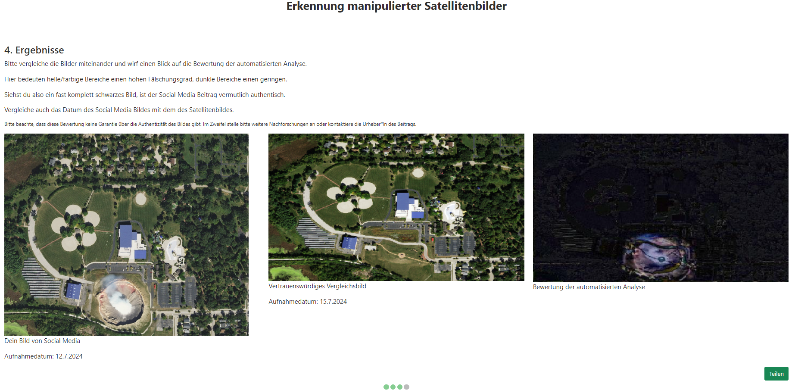

# Semi-automatische Erkennung manipulierter Satellitenbilder in sozialen Medien durch Vergleich mit Referenzdaten
English title: _Semi-automatic detection of manipulated satellite imagery in social media by comparison with reference data_

Dieses Repository enthält den Code der im Rahmen meiner Bachelorarbeit an der [Universität Münster](https://www.uni-muenster.de/Geoinformatics/) entwickelten Anwendung.
## Zusammenfassung
In den letzten Jahren haben sich die Möglichkeiten zur künstlichen Erstellung oder Manipulation von Bildern durch Fortschritte in Künstlicher Intelligenz (KI), Machine Learning und Computer Vision rasant weiterentwickelt. Vor diesem Hintergrund beschreibt diese Bachelorarbeit die Entwicklung einer Anwendung zur semi-automatischen Erkennung von gefälschten Satellitenbildern in sozialen Medien. Die Anwendung übernimmt die zeitaufwändigen Aufgaben des Text-Extrahierens, Lokalisierens und Vergleichens und ermöglicht es, die Ergebnisse einfach zu teilen. Durch die Kombination von Bildmanipulationstechniken, überwachtem maschinellen Lernen und Geocoding wird das Problem der Desinformation in sozialen Medien adressiert und ein Werkzeug zur Bekämpfung dieser geschaffen.

## Anleitung zum Starten der Anwendung
Um alle notwendigen npm-Packages zu installieren, muss in der Programmierumgebung ein neues Konsolenfenster geöffnet und folgender Code eingegeben werden:
```npm install```

Nach erfolgreicher Installation muss ein zweites Konsolenfenster geöffnet werden, um das Frontend und das Backend separat zu starten
In Konsolenfenster 1 muss dann folgender Code eingegeben werden:
```npm start```

In Konsolenfenster 2 muss dann folgender Code eingegeben werden:
```python run_server.py```

## Anleitung zur Nutzung der Anwendung
Nach erfolgreichem Start des Frontends und Backends in der Programmierumgebung ist das Webinterface im Browser unter der Domain **http://localhost:3000/** erreichbar.

### Schritt 1
Hier wird das Bild und der Text des Social Media Posts eingefügt.

<br>
<br>
So sieht die Seite nach dem Einfügen aus:

<br>
<br>
### Schritt 2
Hier wird das Aufnahmedatum eingegeben

<br>
<br>
### Schritt 3
Hier wird der Kartenausschnitt gewählt, um das Social Media Bild zu reproduzieren

<br>
<br>
Es ist möglich, das Bild als transparentes Overlay über die Karte zu legen

<br>
<br>
Mithilfe des Leaflet Draw-Plugins wird ein Bereich gezeichnet

<br>
<br>
### Schritt 4
Auf der Ergebnisseite werden die Ergebnisse angezeigt

